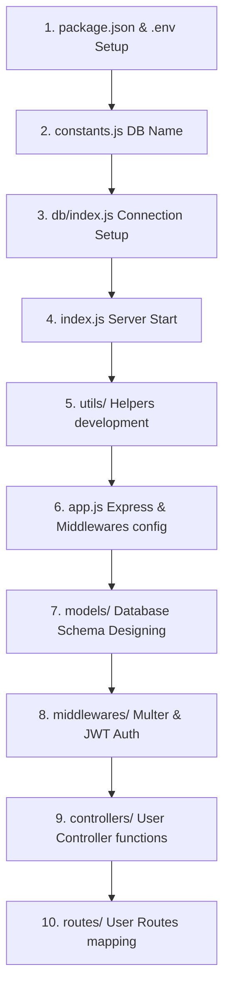

# 🚀 MERN Stack Backend Learning Guide (YouTube-like Backend)

MERN Stack Backend development me aapka swagat hai! Agar aap backend seekh rahe hain, toh ye guide aapko basic folder structure se lekar high-level controllers aur database aggregations tak sab kuch step-by-step samjhayegi.

Humne is document ko Hinglish (Hindi + English) me banaya hai taaki aapko har concept, function aur keyword bilkul simple language me samajh aaye.

---

## 📂 1. Directory & Folder Structure ki Kahani
MERN backend projects me code ko clean aur manageable rakhne ke liye hum modular structure use karte hain. Isse professional industry-level setup banta hai:

```text
d:\SSB_YT\YT_Backend\src
├── 📁 db            -> Database connection logic (.js files)
├── 📁 models        -> Mongoose schemas (Database tables/collections design)
├── 📁 controllers   -> Main business logic (jo requests ko handle karega aur response bhejega)
├── 📁 routes        -> URLs routing setup (kis endpoints pr konsa controller execute hoga)
├── 📁 middlewares   -> Beach-ka-rasta logic (jaise check karna ki user logged in hai ya nahi, files process karna)
├── 📁 utils         -> Helper wrappers aur common tools (API error formatting, success response format, cloudinary)
├── 📄 app.js        -> Express app configuring and middlewares binding
└── 📄 index.js      -> Core entry point (load environments, connect DB, start server)
```

---

## 🛠️ 2. Step-by-Step Flow: Backend Likhna Kahan Se Shuru Karein?
Professional standard ke hisab se backend likhne ka order ye hona chahiye:



1. **Environment Setup & Dependencies**: Sabse pehle `package.json` set up karein aur package download karein. `.env` file banakar secrets set karein.
2. **DB Name Configuration**: `src/constants.js` me database name declare karein.
3. **Database Connection**: `src/db/index.js` me mongoose connect function likhein.
4. **Server Initialization**: `src/index.js` me database connection run karein aur uske bad server listen karayein.
5. **Utility Setup**: Standard error, success responses aur database handlers ko simple banane ke liye `utils/` folder setup karein (like `asyncHandler.js`, `apiError.js`).
6. **Express Config**: `src/app.js` me CORS, cookie-parser, body parsing limits apply karein.
7. **Database Models**: MongoDB collections ka schema likhein inside `models/`.
8. **Middlewares**: File handling (`multer`) aur authorization check (`auth.middleware.js`) banayein.
9. **Controllers**: Main API logic likhein.
10. **Routes**: Endpoints configure karke Controllers map karein.

---

## 🔬 3. Detailed File-by-File & Line-by-Line Explanation

Let's dive deep into every single file inside the project, exploring what every function does, why it is built, and what keywords are used.

---

### 📄 File 1: `src/constants.js`
Is file ka kaam sirf itna hai ki pure project me jo global constants hain, unhe ek hi jagah store kiya jaye.

```javascript
export const DB_NAME = "ssb-Tube"
```
* **`export const`**: Is keyword se hum is variable ko dusri files me `import` karne ke liye ready karte hain.
* **`DB_NAME`**: Humare MongoDB database ka naam. Isse hardcoding se bacha jaata hai.

---

### 📄 File 2: `src/db/index.js`
Database connectivity setup karne ke liye ye wrapper banaya gaya hai.

```javascript
import mongoose from "mongoose";
import { DB_NAME } from "../constants.js";

const connectToDB = async () => {
    try {
        const connectionInstance = await mongoose.connect(`${process.env.MONGODB_URI}/${DB_NAME}`)
        console.log(`\n MONGODB Connected !! DB Host : ${connectionInstance.connection.host} `);
    } catch (error) {
        console.log("MongoDB connection error", error);
        process.exit(1)
        throw error
    }
}

export default connectToDB;
```

#### 🔍 Concept & Keywords:
* **`import mongoose`**: Nodejs aur MongoDB ko jodne wali library (ODM).
* **`async () => { ... }`**: Database connect hone me time lagta hai, isliye is function ko **asynchronous** banaya gaya hai (using async/await).
* **`try-catch`**: Code me koi crash na ho, agar database connection down ho toh error handle ho sake.
* **`await mongoose.connect(...)`**: Program ko tab tak roko jab tak database securely connect na ho jaye. `process.env.MONGODB_URI` humare Cloud/Local DB ka connection string hai.
* **`connectionInstance.connection.host`**: Connect hone ke bad, hume pata chalta hai ki humara host server kahan running hai.
* **`process.exit(1)`**: Agar connection fail ho gaya, toh server ko chalte rehne ka koi fayda nahi. `process.exit(1)` se hum backend process ko immediately terminate (stop) kar dete hain.

---

### 📄 File 3: `src/index.js`
Humare backend server ka entrance point (main engine driver).

```javascript
import dotenv from "dotenv";
dotenv.config({ path: "./.env" })
import connectDB from "./db/index.js";
import { app } from "./app.js";

connectDB()
.then(() => {
    app.listen(process.env.PORT || 8000, () => {
        console.log(`server is running at ${process.env.PORT || 8000}`);
    })
    app.on('error', (err) => {
        console.log("Error in connecting to the database", err)
        throw err
    })
})
.catch((err) => {
    console.log("MONGO Db connection failed", err);
})
```

#### 🔍 Concept & Keywords:
* **`dotenv.config(...)`**: Server start hote hi humari security credentials (jaise JWT secret, DB URI) `.env` file se load ho jati hain.
* **`connectDB().then(...).catch(...)`**: Kyoki `connectDB` ek `async` function hai, ye automatic ek **Promise** return karta hai.
  * **`.then()`**: Agar database connect ho gaya, toh Express server ko listen karwana shuru karo (`app.listen`).
  * **`.catch()`**: Agar connection crash ho gaya, toh setup yahi block ho jaye.
* **`app.on('error', ...)`**: Ye listener tab active hota hai jab Express app listen karte time koi network/port error face karta hai (jaise port already occupied).

---

### 📄 File 4: `src/utils/asyncHandler.js`
Har controller function me baar-baar try-catch likhne se bachne ke liye ye generic function wrapper hai.

```javascript
const asyncHandler = (reqHandler) => {
   return (req, res, next) => {
        Promise.resolve(reqHandler(req, res, next)).catch((err) => next(err))
    }
}
export { asyncHandler }
```

#### 🔍 Concept & Keywords:
* **Higher-Order Function**: Aisa function jo input me ek function leta hai aur output me bhi ek function return karta hai. Yahan `reqHandler` hamara main controller function hai.
* **`Promise.resolve().catch()`**: Agar controller resolve hota hai toh normal flows chalega. Agar usme koi error aati hai (jaise validations fail), toh use catch karke direct Express ke next error-handler middleware `next(err)` ko bhej deta hai. Isse hume har controller me `try-catch` nahi likhna padta!

---

### 📄 File 5: `src/utils/apiError.js`
Aapke pure application me error response ka structure ek jaisa hona chahiye, isliye humne `Error` base class ko extend kiya hai.

```javascript
class apiError extends Error {
    constructor(
        stauscode,
        message = "something went wrong",
        errors = [],
        stack = ""
    ) {
        super(message)
        this.stauscode = stauscode
        this.errors = errors
        this.data = null
        this.message = message
        this.success = false

        if (stack) {
            this.stack = stack
        } else {
            Error.captureStackTrace(this, this.constructor)
        }
    }
}
export { apiError }
```

#### 🔍 Concept & Keywords:
* **`extends Error`**: JavaScript ki standard Error class ke functional features ko customize karne ke liye.
* **`super(message)`**: Parent class (`Error`) ke constructor ko custom message pass karta hai.
* **`Error.captureStackTrace(...)`**: Jab code crash hoga, toh stack trace me exact wo file aur line number dikhegi jahan error trigger hui thi.

---

### 📄 File 6: `src/utils/Apiresponse.js`
Success API response ko clean aur standard pattern me bhejne ke liye utility:

```javascript
class Apiresponse {
    constructor(statusCode, data, message = "success") {
        this.statusCode = statusCode
        this.message = message
        this.data = data
        this.success = statusCode < 400
    }
}
export { Apiresponse }
```
* **`this.success = statusCode < 400`**: HTTP standards ke hisab se 2xx aur 3xx status codes successful events darshate hain. Agar code 400 se chota hai, toh success key automatically `true` ho jayegi.

---

### 📄 File 7: `src/utils/Cloudinary.js`
Local server storage se images/videos ko Cloudinary server par upload karne ke liye:

```javascript
import { v2 as cloudinary } from "cloudinary"
import fs from "fs"

cloudinary.config({
    cloud_name: process.env.CLOUDINARY_CLOUD_NAME,  
    api_key: process.env.CLOUDINARY_API_KEY,
    api_secret: process.env.CLOUDINARY_API_SECRET
})

const uploadonCloudinary = async (localfilepath) => {
    try {
        if (!localfilepath) return null
        // upload file on cloudinary
        const response = await cloudinary.uploader.upload(localfilepath, {
            resource_type: 'auto'
        })
        fs.unlinkSync(localfilepath) 
        return response;
    } catch (error) {
        fs.unlinkSync(localfilepath) // remove the locally saved temporary file when upload fails
        return null
    }
}
export { uploadonCloudinary }
```

#### 🔍 Concept & Keywords:
* **`cloudinary.config`**: Credentials check karke account authentication setup karta hai.
* **`resource_type: 'auto'`**: Cloudinary automatic handle kar leta hai ki file image hai, pdf hai ya video.
* **`fs.unlinkSync(localfilepath)`**: Sabse important step. Jab user image bhejta hai, toh wo temporary taur par hamare local storage (public/temp) folder me save hoti hai. Jab file successfully Cloudinary pr upload ho jaye (ya upload fail ho jaye), toh security aur memory clean rakhne ke liye hum use disk space se delete (`unlink`) kar dete hain.

---

### 📄 File 8: `src/app.js`
Express configuration aur middleware declarations.

```javascript
import express from 'express';
import cors from 'cors';
import cookieParser from 'cookie-parser';

const app = express()

app.use(cors({
    origin: process.env.CORS_ORIGIN,
    credentials: true
}))

app.use(express.json({ limit: '20kb' }))
app.use(express.urlencoded({ extended: true, limit: '20kb' }))
app.use(express.static('public'))
app.use(cookieParser())

// routes import & declaration
import userRouter from './routes/user.routes.js'
app.use('/api/v1/users', userRouter)

export { app }
```

#### 🔍 Concept & Keywords:
* **`cors()`**: **Cross-Origin Resource Sharing**. Iske bina front-end app (e.g., React port 3000) backend API (port 8000) se security restrictions ke chalte communicate nahi kar payega. `origin: process.env.CORS_ORIGIN` wahi specific domains allow karega jinhe hum chahenge.
* **`express.json({limit: '20kb'})`**: Request body (JSON payloads) ka size define karta hai taaki server overflow attacks se secure rahe.
* **`express.urlencoded(...)`**: URL me data send hone par use decode karta hai (jaise: `space` ko `%20` banaya jata hai).
* **`express.static('public')`**: Hamare local assets (e.g. static HTML files, temp uploads folder) publicly serve karne ke liye.
* **`cookieParser()`**: Secure cookies reads/writes setup. Iske through backend client-side cookies generate aur retrieve karta hai.

---

### 📁 4. Deep Dive: Models & Schemas

Mongoose use karke hum MongoDB collections ke schemas define karte hain.

#### 📄 User Model (`src/models/User.model.js`)
Isme user ke saare properties aur safety hooks logic hoten hain.

```javascript
import mongoose, { Schema } from "mongoose";
import jwt from "jsonwebtoken";
import bcrypt from "bcrypt";

const UserSchema = new Schema(
    {
        username: {
            type: String,
            required: true,
            unique: true,
            lowercase: true,
            trim: true,
            index: true // makes database queries faster
        },
        email: {
            type: String,
            required: true,
            unique: true,
            lowercase: true,
            trim: true 
        },
        fullName: {
            type: String,
            required: true,
            trim: true,
            index: true
        },
        avatar: {
            type: String, // cloudinary url
            required: true,
        },
        coverImage: {
            type: String
        },
        watchHistory: [
            {
                type: Schema.Types.ObjectId,
                ref: "Video"
            }
        ],
        password: {
            type: String,
            required: [true, "Password is required"]
        },
        refreshToken: {
            type: String
        },
    },
    { timestamps: true }
)

// pre save hook: password hashing
UserSchema.pre("save", async function(next) {
    if (!this.isModified("password")) return next();
    this.password = await bcrypt.hash(this.password, 10);
    next();
})

// custom method to check password validity
UserSchema.methods.isPasswordCorrect = async function(password) {
    return await bcrypt.compare(password, this.password)
}

// Access Token Generation
UserSchema.methods.generateAccessToken = function() {
   return jwt.sign(
       {
            _id: this._id,
            email: this.email,
            username: this.username,
            fullName: this.fullName
       },
       process.env.ACCESS_TOKEN_SECRET,
       {
           expiresIn: process.env.ACCESS_TOKEN_EXPIRY
       }
   )
}

// Refresh Token Generation
UserSchema.methods.generateRefreshToken = function() {
     return jwt.sign(
         {
            _id: this._id,
         },
         process.env.REFRESH_TOKEN_SECRET,
         {
            expiresIn: process.env.REFRESH_TOKEN_EXPIRY
         }
     )
}

export const User = mongoose.model("User", UserSchema)
```

##### 🔍 Schema Details & Hooks:
* **`index: true`**: Agar hum username ko frequently search karenge database me, toh is index variable se search query direct fast resolve ho jati hai.
* **`UserSchema.pre("save", ...)`**: Isko "Mongoose Middleware Hook" kehte hain. Document save hone se pehle ye function automatic chalega.
  * **Warning**: Humne arrow function (`() => {}`) isliye nahi use kiya kyoki arrow function me `this` keyword context override ho jata hai. Standard function likhne se `this` target user schema data banata hai.
  * **`this.isModified("password")`**: Password tabhi hash hona chahiye jab user naya ban raha ho ya apna password edit kar raha ho. Agar user sirf bio ya avatar update kar raha hai, toh same hashing logic chalega toh password double hash ho jayega.
* **`jwt.sign(payload, secret, options)`**: Access Token (temporary short session) aur Refresh Token (long session renewal) generate karne ke liye authentication token sign kiya jata hai.

---

#### 📄 Video Model (`src/models/Video.model.js`)
Videos ki dynamic listings aur pages support karne ke liye:

```javascript
import mongoose from "mongoose";
import mongooseAggregatePaginate from "mongoose-aggregate-paginate-v2";

const VideoSchema = new mongoose.Schema(
    {
        videoFile: {
            type: String, // cloudinary url
            required: true,
        },
        thumbnail: {
            type: String, 
            required: true
        },
        title: {
             type: String, 
            required: true
        },
        description: {
            type: String, 
            required: true
        },
        duration: {
            type: Number, // from cloudinary info
            required: true
        },
        views: {
            type: Number,
            default: 0,
            required: true
        },
        isPublished: {
            type: Boolean,
            default: true,
        },
        owner: {
            type: mongoose.Schema.Types.ObjectId,
            ref: "User"
        }
    },
    { timestamps: true }
)

VideoSchema.plugin(mongooseAggregatePaginate)
export const Video = mongoose.model("Video", VideoSchema)
```
* **`mongooseAggregatePaginate`**: Mongoose plugin jo backend aggregation queries me automatic pagination support lagata hai (jaise video feed loading page 1, page 2 etc).

---

#### 📄 Subscriptions Model (`src/models/Subscriptions.model.js`)
Followers / Channels network setup design:

```javascript
import mongoose, { Schema } from "mongoose";
const SubscriptionsSchema = new Schema({
    subscriber: {
        type: Schema.Types.ObjectId, //one who is subscribing
        ref: "User"
    },
    channel: {
        type: Schema.Types.ObjectId, //one to whom subscriber is subscribing
        ref: "User"
    }
}, { timestamps: true })

export const Subscription = mongoose.model("Subscription", SubscriptionsSchema)
```
* Subscribers count nikalne ke liye hum standard documents match calculation lagate hain jahan user channel match hota hai.

---

### 🛡️ 5. Middlewares setup

Middlewares route hit karne se pehle authentication aur checks execute karte hain.

#### 📄 Multer Middleware (`src/middlewares/multer.middleware.js`)
Form-data files upload handling logic:

```javascript
import multer from "multer";

const storage = multer.diskStorage({
    destination: function (req, file, cb) { 
        cb(null, "./public/temp")
    },
    filename: function (req, file, cb) {
        cb(null, file.originalname)
    }
})

export const upload = multer({ storage: storage })
```
* **`diskStorage`**: Files direct hard disk me folder wise manage hongi.
* **`cb(null, "./public/temp")`**: Callback function. Sabse pehle folder load check karega aur files store karke local storage verify karega.

---

#### 📄 Auth Middleware (`src/middlewares/auth.middleware.js`)
Logged-in users verification logic:

```javascript
import { User } from "../models/User.model.js";
import { apiError } from "../utils/apiError.js";
import { asyncHandler } from "../utils/asyncHandler.js";
import jwt from "jsonwebtoken";

export const verifyJWT = asyncHandler(async (req, res, next) => {
    try {
        const token = req.cookies?.accessToken || req.header?.authorization?.replace("Bearer ", "")
        if (!token) {
            throw new apiError(401, "Unauthorized Request")
        }
    
        const decodedToken = jwt.verify(token, process.env.ACCESS_TOKEN_SECRET)
        const user = await User.findById(decodedToken?._id).select("-password -refreshToken")
    
        if (!user) {
            throw new apiError(401, "Invalid Access Token")
        }
    
        req.user = user;
        next();
    } catch (error) {
        throw new apiError(401, error?.message || "Invalid Access Token")
    }
});
```
* **`req.header?.authorization?.replace(...)`**: Mobile apps token standard headers (`Bearer <token>`) me bhejti hain, aur browsers use cookies me process karte hain. Ye middleware dono paths validation support karta hai.
* **`req.user = user`**: JWT valid hone par, hum database se main profile nikal kar pure request lifecycle object me set kar dete hain, taki next routes bina token parse kiye direct user query use kar sakein.
* **`next()`**: Agar token right hai toh next controller process trigger ho.

---

### 🌐 6. Routes Setup (`src/routes/user.routes.js`)
URLs endpoints definition map:

```javascript
import { Router } from "express";
import { 
    changeCurrentPassword, 
    getCurrentUser, 
    getUserChannelProfile, 
    getWatchHistory, 
    loginUser, 
    logoutUser, 
    refreshAccessToken, 
    registerUser, 
    updateAccountDetails, 
    updateUserAvatar, 
    updateUserCoverImage 
} from "../controllers/user.controller.js";
import { upload } from "../middlewares/multer.middleware.js";
import { verifyJWT } from "../middlewares/auth.middleware.js";

const router = Router();

router.route("/register").post(
    upload.fields([
        { name: "avatar", maxCount: 1 },
        { name: "coverImage", maxCount: 1 }
    ]),
    registerUser
)

router.route("/login").post(loginUser)

// Secure routes (verifyJWT applied)
router.route("/logout").post(verifyJWT, logoutUser)
router.route("/refresh-token").post(refreshAccessToken)
router.route("/change-password").post(verifyJWT, changeCurrentPassword)
router.route("/current-user").post(verifyJWT, getCurrentUser)
router.route("/update-account").patch(verifyJWT, updateAccountDetails)
router.route("/avatar").patch(verifyJWT, upload.single("avatar"), updateUserAvatar)
router.route("/cover-Image").patch(verifyJWT, upload.single("coverImage"), updateUserCoverImage)
router.route("/c/:username").get(verifyJWT, getUserChannelProfile)
router.route("/watch-history").get(verifyJWT, getWatchHistory)

export default router
```
* **`upload.fields(...)`**: Jab register endpoint hit hota hai, Multer is route se specific inputs (`avatar` and `coverImage`) accept karta hai aur files local disk me save karke controllers execute karata hai.
* **`verifyJWT` as a wrapper**: Secure routes me route handler (controller) run hone se pehle authentication middleware pass hota hai.

---

### 🎮 7. Controllers Logic (`src/controllers/user.controller.js`)
Humare project ka sabse bada aur logical brain center. Isme hamare saare operational functions hain.

#### 🗝️ 1. Token Generator Function
```javascript
const generateAccessAndRefreshToken = async (userId) => {
   try {
     const user = await User.findById(userId)
     const accessToken = user.generateAccessToken()
     const refreshToken = user.generateRefreshToken()

     user.refreshToken = refreshToken
     await user.save({ validateBeforeSave: false }) // pass valid validation exception

     return { accessToken, refreshToken }
   } catch (error) {
     throw new apiError(500, "Error in generating access and refresh token")
   }
}
```
* **`validateBeforeSave: false`**: Database schemas me values save karte time checks apply hote hain (jaise email, fullName rules). Kyoki hum yahan user object me sirf refresh token update kar rahe hain, hum schema ke baaki components validations ko skip kar sakte hain.

#### 👥 2. User Registration Flow (`registerUser`)
Steps mapping:
1. **Inputs read**: `fullName`, `email`, `username`, `password` extract from `req.body`.
2. **Validations check**: Har string value check hogi ki wo empty to nahi hai.
3. **Database unique key checks**: Email ya Username matches database me validation scan karenge.
4. **File extraction**: Multer local folders files check verify karega.
5. **Cloudinary Upload**: Files upload on Cloudinary.
6. **DB write entry creation**: `User.create({...})` model insertion.
7. **Response generation**: Response se password remove karke send successfully response.

#### 🔒 3. User Login Flow (`loginUser`)
Steps:
1. Email/Username filter.
2. User select query database checking.
3. Password verify check `user.isPasswordCorrect(password)`.
4. Generate dynamic access/refresh token codes.
5. **`httpOnly: true`**: Cookies check properties setting, jisse Javascript applications cookies read nahi kar pati aur script payload hijacking security badh jati hai.

#### 🔄 4. Advanced: MongoDB Aggregation Pipelines (Channels profile calculation)
MERN stack development ka sabse advanced topic **MongoDB Aggregations** hai. Chaliye ise details me samjhein (`getUserChannelProfile`):

```javascript
const channel = await User.aggregate([
    {
        $match: {
            username: username?.toLowerCase()
        }
    },
    {
        $lookup: {
            from: "subscriptions",
            localField: "_id",
            foreignField: "channel",
            as: "subscribers"
        }
    },
    {
        $lookup: {
             from: "subscriptions",
            localField: "_id",
            foreignField: "subscriber",
            as: "subscribedTo"
        }
    },
    {
        $addFields: {
            subscribersCount: {
                $size: "$subscribers"
            },
            channelSubscribedToCount: {
                $size: "$subscribedTo"
            },
            isSubscribed: {
                $cond: {
                    if: { $in: [req.user?._id, "$subscribers.subscriber"] },
                    then: true,
                    else: false
                }
            }
        }
    },
    {
        $project: {
            fullName: 1,
            username: 1,
            subscribersCount: 1,
            channelSubscribedToCount: 1,
            isSubscribed: 1,
            avatar: 1,
            coverImage: 1,
            email: 1,
        }
    }
])
```

##### 🔍 Aggregation Pipeline Operations Explained:
* **`$match`**: Database se sirf us exact user ka doc select karega jiska username unique link search request se matched hai.
* **`$lookup`**: SQL ke **JOIN** ki tarah kaam karta hai. Ye `User` collection ke dynamic ids ko `subscriptions` collection me filter karta hai.
  * **`from`**: Kis dusre database collection se coordinate karna hai (e.g. `subscriptions`). Note: Mongoose backend database collections ko default plural lowercase (Subscriptions -> subscriptions) banata hai.
  * **`localField`**: Current table ka reference variable (`_id`).
  * **`foreignField`**: Dusri table (`subscriptions`) ka matching reference target variable (`channel` / `subscriber`).
  * **`as`**: Jo outputs items aayenge, unhe current record me kis naye field/array name se save kiya jaye (e.g., `subscribers`).
* **`$addFields`**: Humare query results output variables schema documents me dynamic values inject karta hai.
  * **`$size`**: Subscriptions arrays records calculation counts nikalta hai (`subscribersCount`).
  * **`$cond`**: Conditional operator (If-Else condition). Agar user request subscriber arrays objects lists me logged-in dynamic session id `req.user?._id` matching pata hai, toh `isSubscribed` flag dynamically `true` set ho jata hai, else `false`.
* **`$project`**: Client page data filters setting. Isme hum filter configure kar dete hain ki backend output request se password, tokens templates bypass ho jaye aur specific variables list data (like `username`, `avatar`) 1 pass flag par load ho.

---

## 🏆 8. Quick Summary for Your Learning Path
Is pure project ke concepts ko master karne ke liye in topics ko sequence wise study karein:
1. **Express Request Lifecycle**: Client ➡️ Route ➡️ Middleware ➡️ Controller ➡️ Response.
2. **Asynchronous Handling**: Javascript promises aur event stack execution concepts.
3. **Database Relationships**: Models collections parameters (ObjectIds, refs).
4. **Token Security**: JWT structure (header, payload, signature), cookies configuration (`httpOnly`).
5. **Aggregations**: Database calculations speed up filters setups.

Aap is guide ko read karein, aur code file check karein. Happy Coding! 🚀
